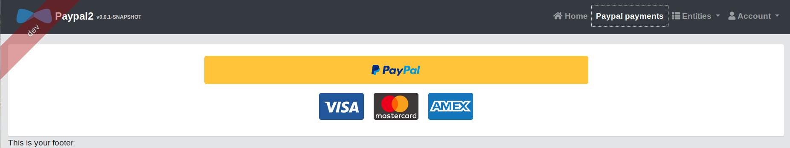
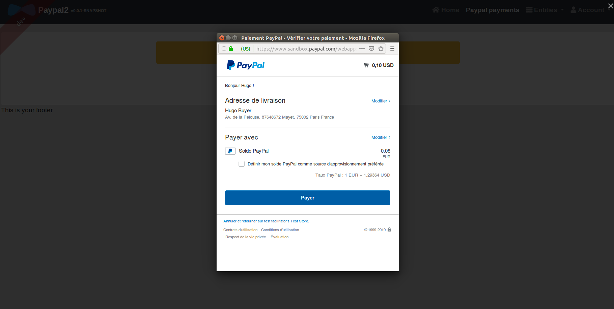
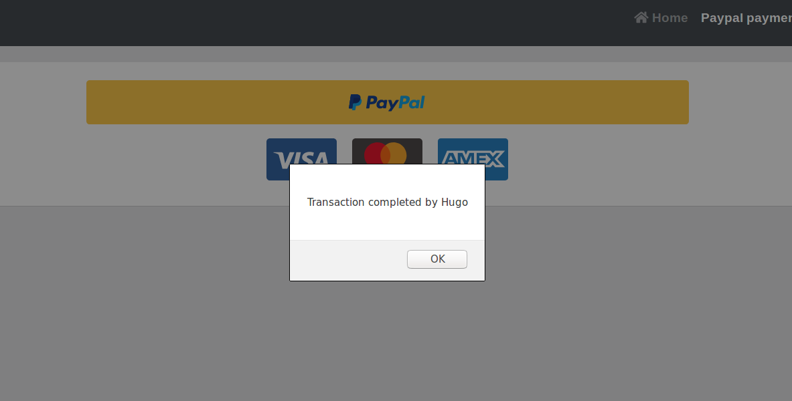
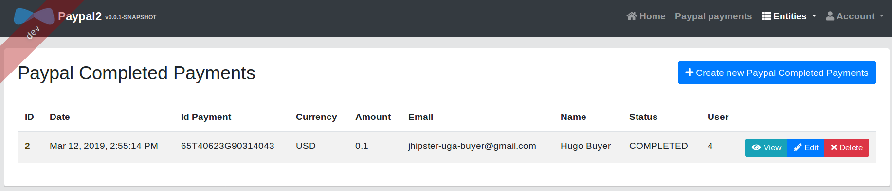

# generator-jhipster-paypal
[![NPM version][npm-image]][npm-url] [![Build Status][travis-image]][travis-url] [![Dependency Status][daviddm-image]][daviddm-url]
> JHipster module, This module allows you to integrate Paypal payment into a JHipster project that works with angular. It creates a new paypal payment page on your jhipster project and adds a new entity (PaypalCompletedPayments) that retrieves information when a paypal payment is made.

# Introduction

This is a [JHipster](http://jhipster.github.io/) module, that is meant to be used in a JHipster application.

This module also works with a Paypal cliend ID (you can have one on : https://developer.paypal.com/).
But you can still test the module without entering a paypal client ID. Simply press enter when you are asked to enter your client ID.

# Screenshots









# Prerequisites

As this is a [JHipster](http://jhipster.github.io/) module, we expect you have JHipster and its related tools already installed:

- [Installing JHipster](https://jhipster.github.io/installation.html)

# Installation

## With Yarn

To install this module:

```bash
yarn global add generator-jhipster-paypal
```

To update this module:

```bash
yarn global upgrade generator-jhipster-paypal
```

## With NPM

To install this module:

```bash
npm install -g generator-jhipster-paypal
```

To update this module:

```bash
npm update -g generator-jhipster-paypal
```

# License

MIT © [Contribution Jhipster UGA](https://github.com/contribution-jhipster-uga)


[npm-image]: https://img.shields.io/npm/v/generator-jhipster-paypal.svg
[npm-url]: https://npmjs.org/package/generator-jhipster-paypal
[travis-image]: https://travis-ci.org/contribution-jhipster-uga/generator-jhipster-paypal.svg?branch=master
[travis-url]: https://travis-ci.org/contribution-jhipster-uga/generator-jhipster-paypal
[daviddm-image]: https://david-dm.org/contribution-jhipster-uga/generator-jhipster-paypal.svg?theme=shields.io
[daviddm-url]: https://david-dm.org/contribution-jhipster-uga/generator-jhipster-paypal
